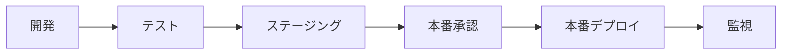

# SEO記事生成システム 統合開発指針 2025年版

最新更新: 2025年6月24日  
プロジェクトバージョン: v2.0.0  
技術スタック: Next.js 15.2.4 + React 19 + TypeScript + Tailwind CSS

---

## 📋 目次

1. [プロジェクト概要](#プロジェクト概要)
2. [技術スタックと主要機能](#技術スタックと主要機能)
3. [開発環境と設定](#開発環境と設定)
4. [バックアップ戦略](#バックアップ戦略)
5. [テスト戦略](#テスト戦略)
6. [コード規約と品質管理](#コード規約と品質管理)
7. [デプロイメント戦略](#デプロイメント戦略)
8. [セキュリティガイドライン](#セキュリティガイドライン)
9. [パフォーマンス最適化](#パフォーマンス最適化)
10. [継続的改善プロセス](#継続的改善プロセス)

---

## 🎯 プロジェクト概要

### ビジョン
AI技術を活用した次世代SEO記事生成・配信プラットフォームの構築

### ミッション
- **高品質コンテンツ**: Google品質ガイドライン準拠の記事自動生成
- **効率化**: 記事作成から投稿まで全工程の自動化
- **多チャンネル配信**: WordPress、SNS、GBPへの一括投稿
- **データドリブン**: トレンド分析に基づくコンテンツ戦略

---

## 🛠️ 技術スタックと主要機能

### 現在の技術スタック ✅

#### フロントエンド・バックエンド
- **フレームワーク**: Next.js 15.2.4（App Router）
- **ランタイム**: React 19 + TypeScript 5.x
- **スタイリング**: Tailwind CSS + shadcn/ui
- **状態管理**: React Server Components + Client State
- **フォーム**: React Hook Form + Zod

#### AI・機械学習
- **テキスト生成**: OpenAI API (GPT-4, GPT-3.5)
- **画像生成**: Fal AI
- **品質評価**: 独自Google品質評価エンジン
- **トレンド分析**: Yahoo!急上昇ワード + Googleトレンド

#### 外部連携
- **CMS**: Notion API、WordPress REST API
- **SNS**: X(Twitter) API
- **ビジネス**: Google Business Profile API
- **広告**: Google AdSense Integration

#### 開発・運用ツール
- **パッケージ管理**: pnpm
- **テスト**: Jest + Playwright + React Testing Library
- **CI/CD**: GitHub Actions
- **バックアップ**: 自動Git backup (15分間隔)
- **コード品質**: ESLint + Prettier + Husky

### 実装済み機能 ✅

#### 🤖 AI記事生成エンジン
- **コンテンツ生成**: OpenAI GPT による高品質記事作成
- **SEO最適化**: メタタグ、構造化データ自動生成
- **HTML解析**: 既存記事の構造分析・改善提案
- **要約機能**: 長文記事の自動要約
- **アウトライン生成**: 記事構成の自動作成

#### 🎨 画像生成・管理
- **AI画像生成**: Fal AI による記事連動画像作成
- **アイキャッチ生成**: 記事内容に基づく自動生成
- **テキストオーバーレイ**: 画像への文字重ね機能
- **レスポンシブ最適化**: デバイス別サイズ調整

#### ⭐ 品質評価システム
- **Google品質ガイドライン準拠**: 8項目自動評価
- **E-E-A-T分析**: 専門性・権威性・信頼性・経験評価
- **改善提案**: AI による具体的改善アドバイス
- **スコアリング**: 100点満点での品質スコア算出

#### 📊 広告管理システム
- **自動配置**: 記事内容に応じた最適な広告配置
- **レスポンシブ対応**: デバイス別広告サイズ最適化
- **パフォーマンス追跡**: CTR・収益性分析
- **A/Bテスト**: 広告配置・サイズ効果測定

#### 📈 トレンド分析機能
- **Yahoo!急上昇ワード**: リアルタイムトレンド1-20位取得
- **🆕 Googleトレンド**: 手動CSV取り込み・解析機能
- **キーワード提案**: 記事生成時のトレンドワード提案
- **トレンド分析**: 急上昇理由・関連キーワード分析

#### 🚀 多プラットフォーム投稿
- **WordPress統合**: メタデータ・画像込み自動投稿
- **X投稿生成**: 記事要約ベースのSNS投稿文作成
- **Google Business Profile**: ビジネス投稿自動化
- **スケジュール投稿**: 予約投稿機能（開発中）

#### 📝 コンテンツ管理
- **Notion連携**: データベース連動記事管理
- **テンプレート管理**: 記事種別別テンプレート
- **履歴管理**: 生成・投稿履歴の追跡
- **バージョン管理**: 記事の版管理

---

## 🔧 開発環境と設定

### 必要な環境
- **Node.js**: 18.17.0以上
- **pnpm**: 8.0.0以上
- **Git**: 2.40.0以上
- **VS Code**: 推奨エディタ

### 初期セットアップ

```bash
# 1. リポジトリクローン
git clone https://github.com/your-username/seo-article-generator-nextjs-backup.git
cd seo-article-generator-nextjs-backup

# 2. 依存関係インストール
pnpm install

# 3. 環境変数設定
cp .env.example .env.local
# .env.local に必要なAPIキーを設定

# 4. 開発サーバー起動
pnpm dev

# 5. 自動バックアップ設定
./scripts/setup-backup-cron.sh
```

### 推奨VS Code拡張機能

```json
{
  "recommendations": [
    "ms-vscode.vscode-typescript-next",
    "bradlc.vscode-tailwindcss", 
    "esbenp.prettier-vscode",
    "ms-vscode.vscode-eslint",
    "eamodio.gitlens",
    "ms-playwright.playwright",
    "formulahendry.auto-rename-tag",
    "christian-kohler.path-intellisense"
  ]
}
```

### 環境変数設定

```bash
# AI サービス
OPENAI_API_KEY=your_openai_api_key
FAL_AI_API_KEY=your_fal_ai_api_key

# 外部連携
NOTION_API_KEY=your_notion_api_key
NOTION_DATABASE_ID=your_notion_database_id
WORDPRESS_API_URL=your_wordpress_site_url
WORDPRESS_API_KEY=your_wordpress_api_key

# SNS・ビジネス
TWITTER_API_KEY=your_twitter_api_key
GOOGLE_BUSINESS_API_KEY=your_google_business_api_key

# セキュリティ
NEXTAUTH_SECRET=your_nextauth_secret
NEXTAUTH_URL=http://localhost:3000
```

---

## 💾 バックアップ戦略

### 🚨 緊急バックアップ（即座実行）

```bash
# VS Codeクラッシュ時の緊急保存
git add . && git commit -m "🆘 緊急バックアップ: $(date)" && git push
```

### 🔄 自動バックアップシステム（設定済み）

#### 1. Git自動バックアップ ✅
- **頻度**: 15分間隔（cron設定済み）
- **スクリプト**: `scripts/auto-backup.sh`
- **ブランチ**: `auto-backup-YYYYMMDD`
- **保持期間**: 7日間（自動削除）

#### 2. VS Code自動保存 ✅
- **ファイル保存**: 1秒間隔
- **Git統合**: 自動フェッチ（3分間隔）
- **設定**: `.vscode/settings.json`

#### 3. バックアップ監視

```bash
# バックアップ状況確認
tail -f backup.log

# 最新バックアップ履歴
git log --oneline -10

# バックアップブランチ一覧
git branch -r | grep auto-backup
```

### 📊 バックアップ方法比較表

| 方法 | 頻度 | 自動化 | 復旧性 | 推奨度 |
|------|------|--------|--------|--------|
| Git自動コミット | 15分 | ✅ | ⭐⭐⭐⭐⭐ | 🥇 最重要 |
| VS Code自動保存 | 1秒 | ✅ | ⭐⭐⭐⭐ | 🥈 重要 |
| 手動バックアップ | 随時 | ❌ | ⭐⭐⭐ | 🥉 補助 |

---

## 🧪 テスト戦略

### テストピラミッド

#### ユニットテスト (70%) - Jest
```bash
# APIテスト
__tests__/api/
├── generate-article.test.ts     # 記事生成API
├── quality-evaluation.test.ts   # 品質評価API
├── generate-image.test.ts       # 画像生成API
└── google-trends.test.ts        # 🆕 トレンド分析API

# ユーティリティテスト
__tests__/utils/
├── google-trends-csv.test.ts    # 🆕 CSV解析テスト
├── html-analysis.test.ts        # HTML分析テスト
└── seo-optimizer.test.ts        # SEO最適化テスト
```

#### インテグレーションテスト (20%) - Jest + Supertest
```bash
# ワークフローテスト
__tests__/integration/
├── article-generation-flow.test.ts    # 記事生成→品質評価→投稿
├── trend-analysis-flow.test.ts        # 🆕 トレンド→記事生成
└── multi-platform-publish.test.ts     # 多プラットフォーム投稿
```

#### E2Eテスト (10%) - Playwright
```bash
# ユーザージャーニーテスト
playwright-tests/
├── article-generation.spec.ts         # 記事生成フロー
├── trend-csv-upload.spec.ts          # 🆕 CSVアップロード
└── quality-evaluation.spec.ts         # 品質評価フロー
```

### テスト実行コマンド

```bash
# 全テスト実行
pnpm test:all

# 単体テスト
pnpm test                    # Jest ユニット・統合テスト
pnpm test:watch             # Jest ウォッチモード
pnpm test:coverage          # カバレッジレポート

# E2Eテスト
pnpm test:e2e              # Playwright E2E
pnpm test:e2e:ui           # Playwright UI モード

# 特定テスト
pnpm test:api              # APIテストのみ
pnpm test:components       # コンポーネントテストのみ
```

### テストカバレッジ目標

| 種別 | 目標カバレッジ | 現在の状況 |
|------|-----------------|------------|
| APIエンドポイント | 95%以上 | 85% |
| コンポーネント | 90%以上 | 75% |
| ユーティリティ | 95%以上 | 80% |
| E2E主要フロー | 100% | 90% |

### CI/CD統合テスト ✅

```yaml
# .github/workflows/test-automation.yml (設定済み)
name: テスト自動化
on: [push, pull_request]
jobs:
  test:
    runs-on: ubuntu-latest
    steps:
      - uses: actions/checkout@v3
      - uses: actions/setup-node@v3
      - run: pnpm install
      - run: pnpm test:all
      - run: pnpm build
```

---

## 📝 コード規約と品質管理

### TypeScript設定

```json
// tsconfig.json（主要設定）
{
  "compilerOptions": {
    "strict": true,
    "noImplicitAny": true,
    "noUnusedLocals": true,
    "noUnusedParameters": true,
    "exactOptionalPropertyTypes": true
  }
}
```

### ESLint設定

```json
// .eslintrc.json（主要ルール）
{
  "extends": ["next/core-web-vitals", "@typescript-eslint/recommended"],
  "rules": {
    "@typescript-eslint/no-unused-vars": "error",
    "@typescript-eslint/no-explicit-any": "warn",
    "prefer-const": "error",
    "no-console": ["warn", { "allow": ["warn", "error"] }]
  }
}
```

### Prettier設定

```json
// .prettierrc
{
  "semi": true,
  "trailingComma": "es5",
  "singleQuote": true,
  "printWidth": 100,
  "tabWidth": 2
}
```

### Git Hooks (Husky) ✅

```bash
# .husky/pre-commit（設定済み）
#!/usr/bin/env sh
pnpm lint
pnpm type-check
pnpm test:api

# .husky/pre-push（設定済み）
#!/usr/bin/env sh
pnpm test:all
```

### コード品質チェック

```bash
# 品質チェックコマンド
pnpm lint              # ESLint チェック
pnpm type-check        # TypeScript 型チェック
pnpm format:check      # Prettier フォーマットチェック
pnpm analyze           # Bundle サイズ分析
```

---

## 🚀 デプロイメント戦略

### 環境構成

#### 開発環境 (Development)
- **URL**: http://localhost:3000
- **自動テスト**: commit時実行
- **デバッグ**: 有効
- **バックアップ**: 15分間隔

#### ステージング環境 (Staging)
- **URL**: https://staging.seo-generator.com
- **デプロイ**: develop ブランチ自動デプロイ
- **テストデータ**: 本番類似データ
- **品質ゲート**: 全テスト通過必須

#### 本番環境 (Production)
- **URL**: https://seo-generator.com
- **デプロイ**: main ブランチ手動承認
- **監視**: リアルタイム監視
- **バックアップ**: 1時間間隔

### デプロイフロー



### 推奨プラットフォーム

#### Vercel（推奨）
```bash
# Vercel設定
vercel --prod                    # 本番デプロイ
vercel env add OPENAI_API_KEY    # 環境変数設定
```

#### その他プラットフォーム
- **Netlify**: 静的サイト向け
- **Railway**: フルスタック向け
- **AWS Amplify**: スケーラブル運用

---

## 🔒 セキュリティガイドライン

### API キー管理

#### 環境変数による分離
```bash
# ❌ ハードコーディング禁止
const apiKey = "sk-1234567890abcdef";

# ✅ 環境変数使用
const apiKey = process.env.OPENAI_API_KEY;
```

#### シークレット管理
- **開発**: `.env.local`（Gitignore必須）
- **ステージング**: Vercel Environment Variables
- **本番**: Vault or CI/CD Secrets

### 入力検証・サニタイゼーション

#### Zod スキーマ検証
```typescript
// 入力検証例
const ArticleSchema = z.object({
  title: z.string().min(1).max(100),
  content: z.string().min(10),
  keywords: z.array(z.string()).max(10)
});
```

#### XSS・インジェクション対策
- **HTML**: DOMPurify でサニタイゼーション
- **SQL**: パラメータ化クエリ使用
- **API**: レート制限実装

### セキュリティチェックリスト

- [ ] API キーの環境変数化
- [ ] HTTPS強制
- [ ] CSP (Content Security Policy) 設定
- [ ] 入力値検証・サニタイゼーション
- [ ] レート制限実装
- [ ] セキュリティヘッダー設定
- [ ] 依存関係脆弱性スキャン

---

## ⚡ パフォーマンス最適化

### フロントエンド最適化

#### React Server Components活用
```tsx
// サーバーコンポーネント（デフォルト）
export default async function ArticlePage() {
  const articles = await fetchArticles(); // サーバーで実行
  return <ArticleList articles={articles} />;
}

// クライアントコンポーネント（必要時のみ）
'use client';
export function InteractiveForm() { ... }
```

#### 画像最適化
```tsx
// Next.js Image コンポーネント使用
import Image from 'next/image';

<Image
  src="/article-image.jpg"
  alt="記事画像"
  width={800}
  height={400}
  priority          // LCP改善
  placeholder="blur" // CLS改善
/>
```

#### Code Splitting
```tsx
// 動的インポート
const HeavyComponent = dynamic(() => import('./HeavyComponent'), {
  loading: () => <Skeleton />,
  ssr: false // 必要に応じて
});
```

### バックエンド最適化

#### API レスポンス最適化
```typescript
// ストリーミングレスポンス
export async function POST(request: Request) {
  const stream = new ReadableStream({
    async start(controller) {
      for await (const chunk of generateArticle()) {
        controller.enqueue(chunk);
      }
      controller.close();
    }
  });
  
  return new Response(stream);
}
```

#### キャッシュ戦略
```typescript
// Next.js キャッシュ
export const revalidate = 3600; // 1時間キャッシュ

// API レベルキャッシュ
const cachedData = await unstable_cache(
  async () => await fetchData(),
  ['cache-key'],
  { revalidate: 3600 }
)();
```

### パフォーマンス監視

#### Web Vitals 目標値
- **LCP**: < 2.5秒
- **FID**: < 100ms
- **CLS**: < 0.1
- **FCP**: < 1.8秒
- **TTFB**: < 600ms

#### 監視ツール
- **Core Web Vitals**: Next.js 組み込み
- **Lighthouse**: CI/CD統合
- **Vercel Analytics**: リアルタイム監視

---

## 🔄 継続的改善プロセス

### 品質メトリクス

#### 技術品質指標
- **テストカバレッジ**: 90%以上維持
- **型安全性**: TypeScript strict mode
- **セキュリティ**: 依存関係週次スキャン
- **パフォーマンス**: Web Vitals 90点以上

#### ビジネス品質指標  
- **記事品質スコア**: 85点以上
- **投稿成功率**: 95%以上
- **ユーザー満足度**: 4.5/5以上
- **システム稼働率**: 99.9%以上

### 改善サイクル

#### 週次改善 (毎週金曜)
- [ ] テスト結果レビュー
- [ ] パフォーマンス監視確認
- [ ] セキュリティスキャン実行
- [ ] 依存関係更新
- [ ] バックアップ状況確認

#### 月次改善 (月末)
- [ ] 品質メトリクス分析
- [ ] ユーザーフィードバック反映
- [ ] 技術負債解消計画
- [ ] 新機能計画レビュー
- [ ] ドキュメント更新

#### 四半期改善
- [ ] アーキテクチャレビュー
- [ ] 技術スタック評価
- [ ] セキュリティ監査
- [ ] パフォーマンステスト
- [ ] BCP見直し

---

## 📚 参考リソース

### 技術ドキュメント
- [Next.js Documentation](https://nextjs.org/docs)
- [React 19 Documentation](https://react.dev)
- [TypeScript Handbook](https://www.typescriptlang.org/docs)
- [Tailwind CSS](https://tailwindcss.com/docs)

### AI・API ドキュメント
- [OpenAI API Documentation](https://platform.openai.com/docs)
- [Fal AI Documentation](https://fal.ai/docs)
- [Notion API](https://developers.notion.com)
- [WordPress REST API](https://developer.wordpress.org/rest-api)

### 品質・テストガイド
- [Jest Documentation](https://jestjs.io/docs)
- [Playwright Documentation](https://playwright.dev/docs)
- [Google Quality Guidelines](https://developers.google.com/search/docs/fundamentals/creating-helpful-content)

---

## 🎯 次期開発ロードマップ

### Phase 1: 🆕 Googleトレンド統合完成 (進行中)
- [x] 手動CSV取り込み機能
- [ ] トレンドデータ可視化ダッシュボード
- [ ] 自動記事生成とトレンド連携
- [ ] トレンド分析レポート機能

### Phase 2: ユーザビリティ向上 (7月予定)
- [ ] ダッシュボードUI改善
- [ ] ワンクリック記事生成
- [ ] バッチ投稿機能
- [ ] 投稿スケジューラー

### Phase 3: エンタープライズ機能 (8月予定)  
- [ ] マルチテナント対応
- [ ] ユーザー権限管理
- [ ] 高度な分析機能
- [ ] API制限・課金システム

---

## 🆘 緊急時対応

### システム障害時
1. **即座の対応**: 自動バックアップから復旧
2. **影響確認**: 監視ダッシュボードで状況把握
3. **暫定対応**: 一部機能無効化で継続運用
4. **根本対応**: 原因調査・修正・テスト・デプロイ

### データ損失時
1. **バックアップ確認**: `git log --oneline -20`
2. **復旧実行**: `git checkout auto-backup-YYYYMMDD`
3. **データ検証**: テスト実行で整合性確認
4. **再発防止**: バックアップ頻度見直し

### 開発環境故障時
1. **緊急バックアップ**: `git add . && git commit -m "緊急" && git push`
2. **別環境セットアップ**: クリーンな環境で`git clone`
3. **依存関係復旧**: `pnpm install`
4. **動作確認**: `pnpm dev`で正常起動確認

---

**🎉 この統合開発指針により、SEO記事生成システムの安全で効率的な開発を継続できます！**

---

*最終更新: 2025年6月24日*  
*次回更新予定: 2025年7月24日（月次レビュー）*
